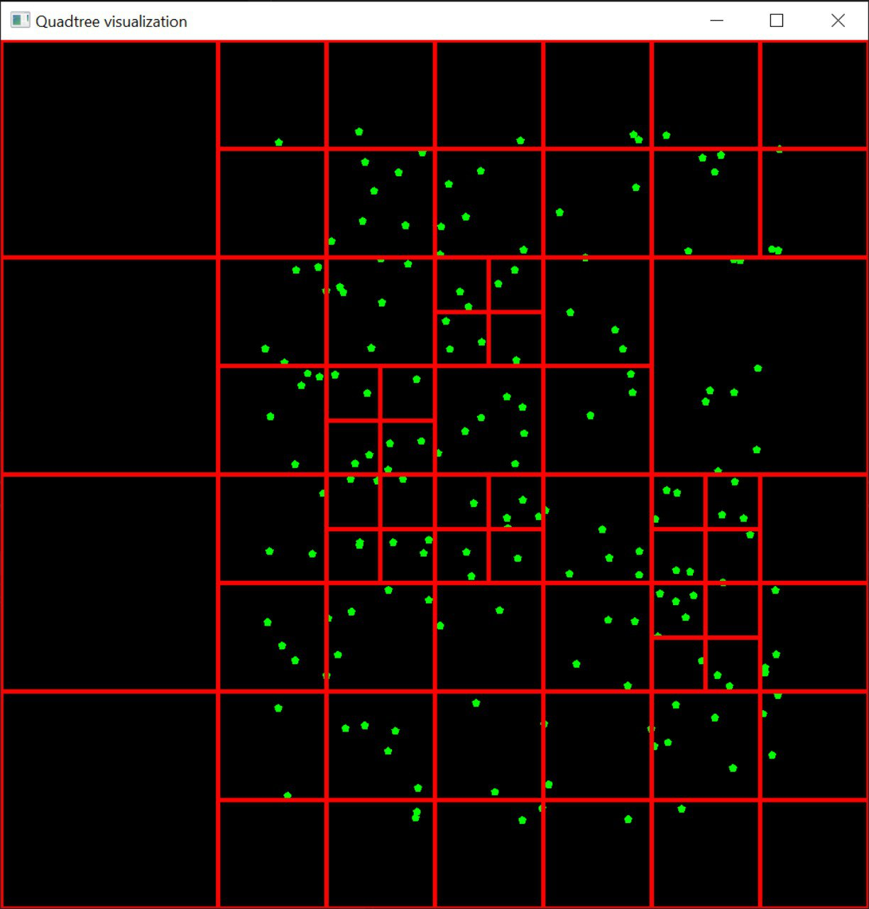

# Quadtree implementation

Quadtree C++ implementation.

Simulation of colliding circles is done using a quadtree for fast neighbor queries:

https://user-images.githubusercontent.com/29884727/165096006-aba7767b-1202-4e40-98a0-69f54f1f3fe6.mp4

Visualization is done using SFML:

